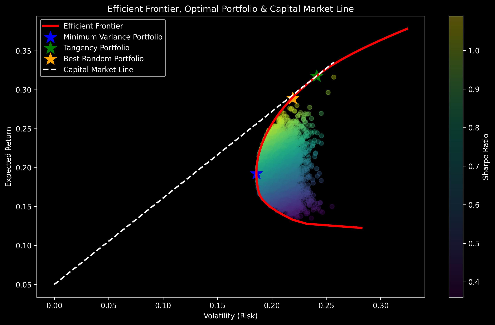

# Mean-Variance Portfolio Optimization

Implementation of Markowitz Portfolio Theory using Python to construct optimal portfolios based on the risk-return tradeoff.

This project demonstrates how to compute the efficient frontier, identify the minimum variance portfolio, and find the maximum Sharpe ratio (tangency) portfolio using real market data.

---

## Project Visualization

The plot shows:
- Random portfolios colored by Sharpe ratio
- Efficient frontier
- Minimum variance portfolio
- Tangency portfolio
- Capital Market Line

---

## Project Overview

Modern Portfolio Theory (MPT), introduced by Harry Markowitz, shows how diversification reduces portfolio risk.

Portfolio variance:

σ²ₚ = wᵀ Σ w

Where:

w = portfolio weights  
Σ = covariance matrix of asset returns

The goal is to find portfolios that minimize risk for a given expected return.

---

## Methodology

### 1. Data Collection

Historical stock prices are downloaded using Yahoo Finance via the yfinance library.

### 2. Return Calculation

Daily returns are computed as:

Rₜ = (Pₜ − Pₜ₋₁) / Pₜ₋₁

Returns are annualized assuming 252 trading days per year.

### 3. Covariance Matrix

The covariance matrix measures how asset returns move together:

Σᵢⱼ = Cov(Rᵢ, Rⱼ)

Lower covariance between assets leads to stronger diversification benefits.

### 4. Portfolio Optimization

Portfolio variance is minimized subject to the constraint:

Σ wᵢ = 1

Optimization is solved using SciPy's SLSQP constrained optimizer.

### 5. Efficient Frontier

Multiple optimization problems are solved across different target returns to generate the efficient frontier, representing optimal portfolios.

### 6. Tangency Portfolio

The tangency portfolio maximizes the Sharpe Ratio:

Sharpe = (E[Rₚ] − Rf) / σₚ

This portfolio lies on the Capital Market Line.

---

## Key Portfolio Results

| Portfolio | Expected Return | Volatility | Sharpe Ratio |
|----------|----------------|-----------|-------------|
| Minimum Variance | Computed in notebook | Computed in notebook | Computed in notebook |
| Tangency Portfolio | Computed in notebook | Computed in notebook | Computed in notebook |
| Best Random Portfolio | Computed in notebook | Computed in notebook | Computed in notebook |

---

## Backtesting

Train Period:
2022–2023

Test Period:
2024

The optimized portfolio is compared against an equal-weight portfolio.

---

## Technologies Used

Python  
NumPy  
Pandas  
Matplotlib  
SciPy  
yfinance

---

## Project Structure

quant-projects
│
├── markowitz-portfolio-optimization
│   ├── markowitz.ipynb
│   ├── efficient_frontier.png
│   └── README.md

---

## Possible Extensions

Rolling portfolio optimization  
Transaction costs  
Short selling constraints  
Black-Litterman model  
Factor models (Fama-French)

---

## References

Markowitz, H. (1952). Portfolio Selection. Journal of Finance.

Stephen Boyd — Convex Optimization

Bodie, Kane & Marcus — Investments

---

## Author

Arnaav Raj

BTech Information Science  
Interested in quantitative finance, portfolio optimization, and financial engineering